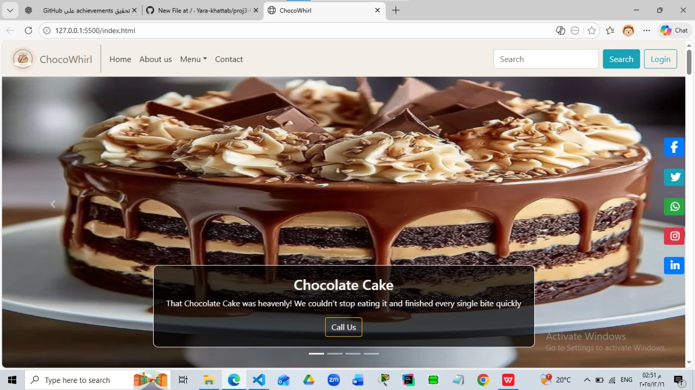

# ChocoWhirl 🍫🍰

ChocoWhirl is a front-end website for a sweets and desserts shop, created as part of the SEF Academy training program.  
The project focuses on building a modern, clean, and fully responsive user interface.

---

## Project Overview
ChocoWhirl represents an online sweets shop that showcases a variety of desserts and cakes.  
The website is designed to provide a smooth and user-friendly browsing experience across different devices.

---

## Pages Included
- Home  
- About Us  
- Menu  
- Contact  

---

## 🛠 Technologies Used
- HTML5  
- CSS3  
- JavaScript  
- Bootstrap (used for layout, components, and responsiveness)

---

## Features
- Modern and clean UI design  
- Fully responsive layout using Bootstrap  
- Navigation bar with multiple sections  
- Search bar and login button  
- Social media links  
- User-friendly design optimized for all screen sizes  

---

## Home Page Preview

---

## How to Run the Project
1. Download or clone the repository.  
2. Open the `index.html` file in any modern web browser.

---

## Academic Purpose
This project was developed as a required front-end project for SEF Academy to practice front-end development concepts and responsive design.

---

## 👩‍💻 Author
Yara Khattab
